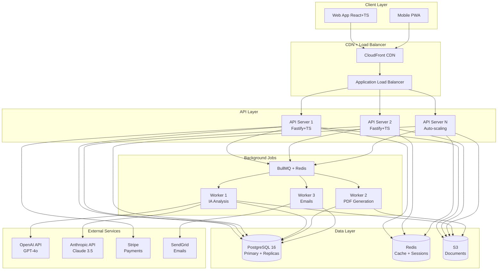

# 2. Arquitetura de Sistema

## 2.1 Diagrama de Arquitetura (Alto Nível)



---

## 2.2 Fluxo de Dados Críticos

### 2.2.1 Fluxo: Criar Solicitação (US-002 Wizard)

```
1. Frontend: Usuário preenche wizard (9 etapas)
   ├─ Auto-save a cada campo (debounced 1.5s)
   └─ Validação client-side (Zod)

2. API POST /api/requests
   ├─ Validação server-side (Zod)
   ├─ Autenticação JWT
   ├─ RBAC check (apenas role=empresa)
   └─ Transação SQL:
       ├─ INSERT INTO requests
       ├─ INSERT INTO products (bulk)
       └─ INSERT INTO certification_processes

3. Background Job: Enqueue "calculate-cost"
   ├─ Worker processa algoritmo multi-variável
   └─ UPDATE requests SET estimated_cost

4. Response 201: {request_id, process_id, estimated_cost}
```

---

### 2.2.2 Fluxo: Análise IA Pré-Auditoria (US-047)

```
1. Frontend: Analista clica "Analisar com IA"

2. API POST /api/processes/{id}/analyze
   ├─ Autenticação JWT (role=analista)
   ├─ Verifica documentos anexados (min 3)
   └─ Enqueue job "ai-pre-audit"

3. Worker IA:
   ├─ Busca documentos do S3
   ├─ Extrai texto (OCR se imagem)
   ├─ Monta prompt com PR 7.1 Rev 21
   ├─ LLM Analysis (OpenAI/Anthropic)
   │   └─ Retry 3x se falhar
   ├─ Parse resposta estruturada (JSON)
   └─ INSERT INTO ai_analysis

4. Notificação Real-time (WebSocket):
   └─ "Análise IA concluída: 87% conformidade"

5. Email: "Sua análise está pronta"
```

---

### 2.2.3 Fluxo: Emissão de Certificado (US-044)

```
1. Frontend: Gestor aprova e clica "Emitir Certificado"

2. API POST /api/processes/{id}/issue-certificate
   ├─ RBAC check (role=gestor)
   ├─ Verifica: comitê aprovado + pagamento confirmado
   └─ Transação SQL:
       ├─ INSERT INTO certificates
       ├─ UPDATE certification_processes SET phase=12
       └─ INSERT INTO audit_trail

3. Background Job: "generate-certificate-pdf"
   ├─ Busca dados do processo
   ├─ Renderiza template HTML (i18n)
   ├─ Gera QR Code (URL verificação)
   ├─ Puppeteer: HTML → PDF
   └─ Upload S3: /certificates/{cert_id}.pdf

4. Background Job: "send-certificate-email"
   ├─ Template multilíngue
   ├─ Anexo: PDF
   └─ SendGrid delivery

5. Notificação: "Certificado emitido! 🎉"
```

---

