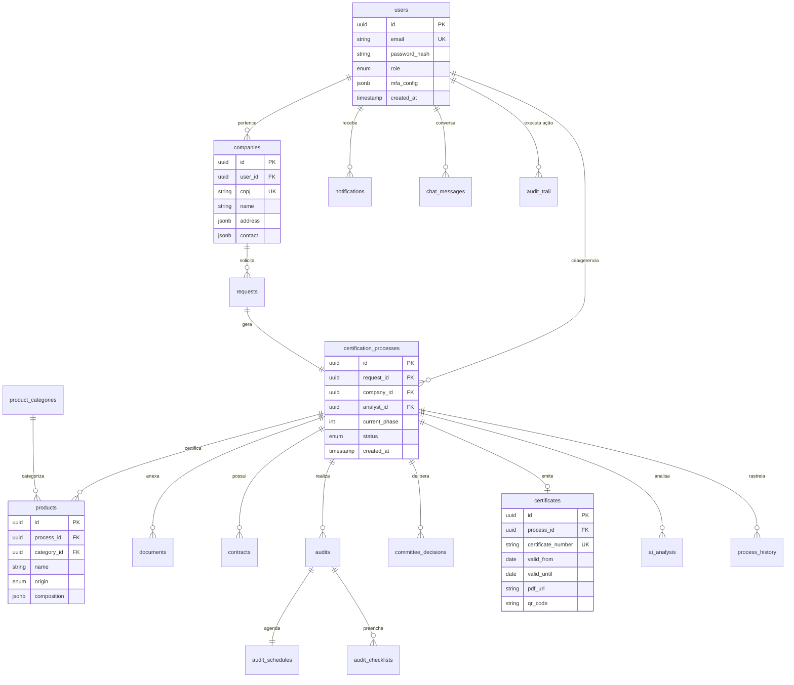

# 3. Database Schema (ERD)

## 3.1 Diagrama Entidade-Relacionamento (Resumido)



---

## 3.2 Diagrama Detalhado (15 Tabelas Principais)

```mermaid
erDiagram
    %% === CORE ENTITIES ===

    users {
        uuid id PK
        string email UK "NOT NULL"
        string password_hash "bcrypt"
        enum role "empresa|analista|auditor|gestor"
        string name "NOT NULL"
        string phone
        jsonb mfa_config "TOTP settings"
        boolean mfa_enabled "default false"
        int login_attempts "rate limiting"
        timestamp locked_until "account lock"
        timestamp last_login
        timestamp created_at
        timestamp updated_at
    }

    companies {
        uuid id PK
        uuid user_id FK "users.id"
        string cnpj UK "14 digits"
        string razao_social "NOT NULL"
        string nome_fantasia
        jsonb address "CEP, rua, cidade, UF"
        jsonb contact "email, phone, whatsapp"
        string website
        int num_employees
        decimal annual_revenue
        text main_activity
        timestamp created_at
        timestamp updated_at
    }

    %% === CERTIFICATION WORKFLOW ===

    requests {
        uuid id PK
        uuid company_id FK "companies.id"
        enum type "nova|renovacao|ampliacao"
        enum certification_type "C1|C2|C3|C4|C5|C6"
        int num_products
        jsonb additional_info "perguntas wizard"
        decimal estimated_cost "calculado por IA"
        enum status "rascunho|enviado|em_analise|aprovado|rejeitado"
        timestamp submitted_at
        timestamp created_at
        timestamp updated_at
    }

    certification_processes {
        uuid id PK
        uuid request_id FK UK "requests.id"
        uuid company_id FK "companies.id"
        uuid analyst_id FK "users.id (analista)"
        uuid auditor_id FK "users.id (auditor)"
        int current_phase "1-12 conforme PR 7.1"
        enum status "em_andamento|pendente|concluido|cancelado|suspenso"
        date deadline
        int priority "1-5, calculado dinamicamente"
        jsonb phase_metadata "dados específicos por fase"
        timestamp started_at
        timestamp completed_at
        timestamp created_at
        timestamp updated_at
    }

    process_history {
        uuid id PK
        uuid process_id FK "certification_processes.id"
        int from_phase
        int to_phase
        uuid changed_by FK "users.id"
        text reason
        jsonb metadata
        timestamp created_at
    }

    %% === PRODUCTS ===

    product_categories {
        uuid id PK
        string code UK "C1|C2|C3|C4|C5|C6"
        string name_pt "Carne e derivados"
        string name_en
        string name_ar
        string name_tr
        text description
        string standard_reference "GSO 2055-2 seção X"
        jsonb requirements "requisitos específicos"
        timestamp created_at
    }

    products {
        uuid id PK
        uuid process_id FK "certification_processes.id"
        uuid category_id FK "product_categories.id"
        string name "NOT NULL"
        enum origin "animal|vegetal|misto|quimico"
        text description
        jsonb composition "ingredientes, percentuais"
        jsonb manufacturing_process "etapas"
        string ncm_code "código NCM fiscal"
        boolean is_exported
        jsonb export_countries "lista de países"
        timestamp created_at
        timestamp updated_at
    }

    %% === DOCUMENTS ===

    documents {
        uuid id PK
        uuid process_id FK "certification_processes.id"
        uuid uploaded_by FK "users.id"
        enum type "contrato_social|licenca|fotos|videos|laudos|outros"
        string original_filename
        string storage_key "S3 path"
        string mime_type
        bigint file_size "bytes"
        string checksum "SHA-256"
        boolean is_required
        enum validation_status "pendente|aprovado|rejeitado"
        text rejection_reason
        timestamp validated_at
        uuid validated_by FK "users.id"
        timestamp created_at
    }

    %% === CONTRACTS ===

    contracts {
        uuid id PK
        uuid process_id FK "certification_processes.id"
        enum type "proposta|contrato"
        string contract_number UK
        decimal total_value "BRL"
        int installments "parcelas"
        text payment_terms
        jsonb line_items "detalhamento custos"
        text special_clauses
        enum status "rascunho|enviado|em_negociacao|assinado|cancelado"
        timestamp sent_at
        timestamp signed_at
        string signature_ip
        jsonb signature_metadata "device, location"
        string pdf_url "contrato assinado"
        timestamp created_at
        timestamp updated_at
    }

    %% === AUDITS ===

    audit_schedules {
        uuid id PK
        uuid auditor_id FK "users.id"
        date schedule_date
        time start_time
        time end_time
        enum status "disponivel|bloqueado|confirmado"
        text notes
        timestamp created_at
    }

    audits {
        uuid id PK
        uuid process_id FK "certification_processes.id"
        uuid auditor_id FK "users.id"
        uuid schedule_id FK "audit_schedules.id"
        enum type "estagio1|estagio2|vigilancia|especial"
        date scheduled_date
        time scheduled_time
        jsonb location "empresa.address ou remoto"
        enum status "agendado|em_andamento|concluido|cancelado"
        int duration_minutes
        text observations
        decimal score "0-100"
        enum result "aprovado|aprovado_condicional|reprovado"
        timestamp started_at
        timestamp completed_at
        timestamp created_at
        timestamp updated_at
    }

    audit_checklists {
        uuid id PK
        uuid audit_id FK "audits.id"
        string checklist_template "PR 7.1 Rev 21 seção X"
        jsonb items "array de {question, answer, evidence, notes}"
        int total_items
        int conforming_items
        int non_conforming_items
        decimal compliance_percentage
        timestamp created_at
        timestamp updated_at
    }

    %% === COMMITTEE & CERTIFICATES ===

    committee_decisions {
        uuid id PK
        uuid process_id FK "certification_processes.id"
        uuid decided_by FK "users.id (gestor)"
        enum decision "aprovar|reprovar|solicitar_info"
        text justification "NOT NULL"
        jsonb voting_details "se votação"
        timestamp decided_at
        timestamp created_at
    }

    certificates {
        uuid id PK
        uuid process_id FK UK "certification_processes.id"
        string certificate_number UK "HS-YYYY-NNNNN"
        date issued_date
        date valid_from
        date valid_until "3 anos"
        jsonb certified_products "lista completa"
        string pdf_url "S3 path"
        string qr_code_data "URL verificação"
        enum status "ativo|suspenso|cancelado|expirado"
        text suspension_reason
        timestamp suspended_at
        timestamp created_at
        timestamp updated_at
    }

    %% === AI & CHAT ===

    ai_analysis {
        uuid id PK
        uuid process_id FK "certification_processes.id"
        uuid requested_by FK "users.id"
        enum analysis_type "pre_auditoria|risco|chatbot"
        string model_used "gpt-4o|claude-3.5-sonnet"
        jsonb input_data "documentos, contexto"
        jsonb output_data "resultados estruturados"
        decimal confidence_score "0.0-1.0"
        int tokens_used
        decimal cost_usd
        int processing_time_ms
        enum status "pendente|concluido|erro"
        text error_message
        timestamp created_at
    }

    chat_messages {
        uuid id PK
        uuid process_id FK "certification_processes.id (nullable)"
        uuid user_id FK "users.id"
        enum role "user|assistant|system"
        text message "NOT NULL"
        jsonb metadata "context, intent"
        string session_id "agrupar conversas"
        boolean is_resolved
        timestamp created_at
    }

    %% === NOTIFICATIONS & AUDIT TRAIL ===

    notifications {
        uuid id PK
        uuid user_id FK "users.id"
        enum type "info|warning|error|success"
        string title "NOT NULL"
        text message
        jsonb action_url "link para ação"
        boolean is_read "default false"
        timestamp read_at
        timestamp created_at
    }

    audit_trail {
        uuid id PK
        uuid user_id FK "users.id"
        enum entity_type "process|contract|certificate|etc"
        uuid entity_id "ID da entidade afetada"
        enum action "create|update|delete|approve|reject"
        jsonb old_values "antes da mudança"
        jsonb new_values "depois da mudança"
        string ip_address
        string user_agent
        timestamp created_at
    }

    %% === RELATIONSHIPS ===

    users ||--o{ companies : "user_id"
    companies ||--o{ requests : "company_id"
    requests ||--|| certification_processes : "request_id"
    certification_processes ||--o{ products : "process_id"
    certification_processes ||--o{ documents : "process_id"
    certification_processes ||--o{ contracts : "process_id"
    certification_processes ||--o{ audits : "process_id"
    certification_processes ||--o{ committee_decisions : "process_id"
    certification_processes ||--|| certificates : "process_id"
    certification_processes ||--o{ ai_analysis : "process_id"
    certification_processes ||--o{ process_history : "process_id"

    users ||--o{ audits : "auditor_id"
    users ||--o{ audit_schedules : "auditor_id"
    audit_schedules ||--o{ audits : "schedule_id"
    audits ||--o{ audit_checklists : "audit_id"

    product_categories ||--o{ products : "category_id"

    users ||--o{ notifications : "user_id"
    users ||--o{ chat_messages : "user_id"
    users ||--o{ audit_trail : "user_id"
    users ||--o{ documents : "uploaded_by"
```

---

