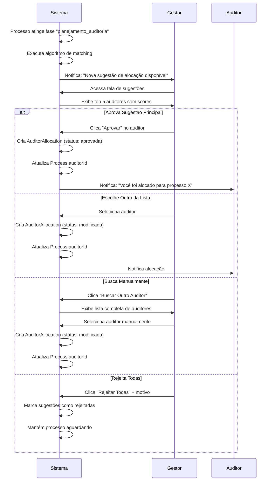

# Proposta: Gestão de Alocação de Auditores por Competências

**Versão:** 1.0
**Data:** 2025-12-17
**Status:** Proposta

## 1. Visão Geral

Sistema inteligente de sugestão e gestão de alocação de auditores baseado em competências técnicas relacionadas aos tipos de indústria/certificação. O sistema **sugere** alocações automaticamente, mas a **decisão final** é sempre do gestor de auditoria.

### 1.1 Objetivos

- ✅ Mapear competências técnicas dos auditores
- ✅ Relacionar competências com tipos de indústria (classificação GSO 2055-2)
- ✅ Sugerir auditores mais qualificados para cada processo
- ✅ Permitir que o gestor aprove, modifique ou rejeite sugestões
- ✅ Manter histórico de alocações e performance
- ✅ Gerar relatórios de capacidade e disponibilidade

## 2. Modelo de Dados

### 2.1 Nova Tabela: `AuditorCompetency`

Armazena as competências técnicas de cada auditor.

```prisma
enum CompetencyLevel {
  basico      // Conhecimento básico
  intermediario // Experiência moderada
  avancado    // Especialista
  certificado // Possui certificação específica
}

model AuditorCompetency {
  id        String   @id @default(dbgenerated("uuid_generate_v4()")) @db.Uuid
  auditorId String   @map("auditor_id") @db.Uuid

  // Competência em Categoria Industrial
  industrialCategoryId String?         @map("industrial_category_id") @db.Uuid
  competencyLevel      CompetencyLevel @map("competency_level")

  // Competência em Tipo de Certificação
  certificationType CertificationType? @map("certification_type")

  // Experiência
  yearsExperience      Int?      @map("years_experience") // Anos de experiência nesta área
  auditsCompleted      Int       @default(0) @map("audits_completed") // Número de auditorias concluídas
  successRate          Decimal?  @map("success_rate") @db.Decimal(5, 2) // Taxa de sucesso (%)

  // Certificações Específicas
  certifications       Json?     // Array de certificações: [{name: "ISO 22000", issuer: "...", validUntil: "..."}]

  // Idiomas
  languages            String[]  @default([]) // ["PT_BR", "ES", "EN", "AR"]

  // Disponibilidade
  isActive             Boolean   @default(true) @map("is_active")
  maxConcurrentAudits  Int       @default(3) @map("max_concurrent_audits")

  // Notas e Observações
  notes                String?   @db.Text

  createdAt            DateTime  @default(now()) @map("created_at")
  updatedAt            DateTime  @updatedAt @map("updated_at")

  // Relações
  auditor          User                @relation("AuditorCompetencies", fields: [auditorId], references: [id], onDelete: Cascade)
  industrialCategory IndustrialCategory? @relation(fields: [industrialCategoryId], references: [id])

  @@unique([auditorId, industrialCategoryId, certificationType])
  @@index([auditorId])
  @@index([industrialCategoryId])
  @@index([certificationType])
  @@index([competencyLevel])
  @@index([isActive])
  @@map("auditor_competencies")
}
```

### 2.2 Nova Tabela: `AuditorAllocation`

Armazena sugestões e alocações de auditores a processos.

```prisma
enum AllocationStatus {
  sugerida    // Sistema sugeriu, aguardando decisão do gestor
  aprovada    // Gestor aprovou a sugestão
  modificada  // Gestor modificou e aprovou
  rejeitada   // Gestor rejeitou a sugestão
  cancelada   // Alocação foi cancelada
}

model AuditorAllocation {
  id        String   @id @default(dbgenerated("uuid_generate_v4()")) @db.Uuid
  processId String   @map("process_id") @db.Uuid
  auditId   String?  @map("audit_id") @db.Uuid // Opcional: vincula a uma auditoria específica

  // Auditores
  suggestedAuditorId String?  @map("suggested_auditor_id") @db.Uuid // Auditor sugerido pelo sistema
  allocatedAuditorId String?  @map("allocated_auditor_id") @db.Uuid // Auditor alocado pelo gestor

  // Score de Compatibilidade (calculado pelo algoritmo)
  matchScore         Decimal? @map("match_score") @db.Decimal(5, 2) // 0-100
  matchReasons       Json?    @map("match_reasons") // Razões da sugestão
  // {
  //   competencyMatch: 95,
  //   experienceYears: 8,
  //   successRate: 92,
  //   language: "PT_BR",
  //   availability: true,
  //   workload: "baixa"
  // }

  // Gestão
  status             AllocationStatus
  allocatedBy        String?  @map("allocated_by") @db.Uuid // Gestor que fez a alocação
  allocationNotes    String?  @map("allocation_notes") @db.Text

  // Timestamps
  suggestedAt        DateTime @default(now()) @map("suggested_at")
  decidedAt          DateTime? @map("decided_at")
  canceledAt         DateTime? @map("canceled_at")

  createdAt          DateTime @default(now()) @map("created_at")
  updatedAt          DateTime @updatedAt @map("updated_at")

  // Relações
  process           Process @relation(fields: [processId], references: [id], onDelete: Cascade)
  audit             Audit?  @relation(fields: [auditId], references: [id])
  suggestedAuditor  User?   @relation("SuggestedAllocations", fields: [suggestedAuditorId], references: [id])
  allocatedAuditor  User?   @relation("AllocatedAudits", fields: [allocatedAuditorId], references: [id])
  manager           User?   @relation("ManagedAllocations", fields: [allocatedBy], references: [id])

  @@index([processId])
  @@index([auditId])
  @@index([suggestedAuditorId])
  @@index([allocatedAuditorId])
  @@index([status])
  @@index([allocatedBy])
  @@map("auditor_allocations")
}
```

### 2.3 Alterações no Model `User`

Adicionar relações para competências e alocações:

```prisma
model User {
  // ... campos existentes ...

  // Relações existentes
  // ...

  // Novas relações para Auditores
  competencies          AuditorCompetency[]   @relation("AuditorCompetencies")
  suggestedAllocations  AuditorAllocation[]   @relation("SuggestedAllocations")
  allocatedAudits       AuditorAllocation[]   @relation("AllocatedAudits")
  managedAllocations    AuditorAllocation[]   @relation("ManagedAllocations")
}
```

### 2.4 Alterações no Model `Process`

```prisma
model Process {
  // ... campos existentes ...

  // Nova relação
  auditorAllocations AuditorAllocation[]
}
```

### 2.5 Alterações no Model `Audit`

```prisma
model Audit {
  // ... campos existentes ...

  // Nova relação
  auditorAllocations AuditorAllocation[]
}
```

## 3. Algoritmo de Sugestão de Auditores

### 3.1 Critérios de Matching (Score 0-100)

O sistema calcula um score de compatibilidade baseado em:

| Critério | Peso | Descrição |
|----------|------|-----------|
| **Competência na Categoria Industrial** | 35% | Nível de competência na categoria industrial do processo |
| **Experiência (Anos)** | 20% | Anos de experiência na área específica |
| **Taxa de Sucesso** | 20% | Histórico de auditorias bem-sucedidas |
| **Número de Auditorias** | 10% | Experiência prática (quantidade de auditorias) |
| **Disponibilidade** | 10% | Capacidade atual (carga de trabalho) |
| **Idioma** | 5% | Compatibilidade linguística com o país da empresa |

### 3.2 Fórmula de Cálculo

```typescript
interface MatchingCriteria {
  competencyScore: number;    // 0-100 baseado no CompetencyLevel
  experienceScore: number;    // 0-100 baseado nos anos
  successRateScore: number;   // 0-100 da taxa de sucesso
  auditsCountScore: number;   // 0-100 baseado na quantidade
  availabilityScore: number;  // 0-100 baseado na carga atual
  languageScore: number;      // 0-100 compatibilidade de idioma
}

function calculateMatchScore(criteria: MatchingCriteria): number {
  const weights = {
    competency: 0.35,
    experience: 0.20,
    successRate: 0.20,
    auditsCount: 0.10,
    availability: 0.10,
    language: 0.05
  };

  return (
    criteria.competencyScore * weights.competency +
    criteria.experienceScore * weights.experience +
    criteria.successRateScore * weights.successRate +
    criteria.auditsCountScore * weights.auditsCount +
    criteria.availabilityScore * weights.availability +
    criteria.languageScore * weights.language
  );
}
```

### 3.3 Conversão de Níveis de Competência

```typescript
const competencyLevelScores = {
  'certificado': 100,
  'avancado': 85,
  'intermediario': 60,
  'basico': 35
};
```

### 3.4 Cálculo de Disponibilidade

```typescript
function calculateAvailabilityScore(
  currentAudits: number,
  maxConcurrentAudits: number
): number {
  const utilization = currentAudits / maxConcurrentAudits;

  if (utilization >= 1.0) return 0;     // Completamente alocado
  if (utilization >= 0.8) return 30;    // Quase no limite
  if (utilization >= 0.6) return 60;    // Carga moderada
  if (utilization >= 0.4) return 80;    // Carga baixa
  return 100;                            // Disponível
}
```

## 4. APIs Backend

### 4.1 Gestão de Competências

```typescript
// backend/src/modules/auditor-competency/auditor-competency.routes.ts

// POST /api/auditor-competencies
// Criar/atualizar competência de um auditor
interface CreateCompetencyDTO {
  auditorId: string;
  industrialCategoryId?: string;
  certificationType?: CertificationType;
  competencyLevel: CompetencyLevel;
  yearsExperience?: number;
  certifications?: Array<{
    name: string;
    issuer: string;
    validUntil?: string;
  }>;
  languages?: string[];
  maxConcurrentAudits?: number;
  notes?: string;
}

// GET /api/auditor-competencies/:auditorId
// Listar todas as competências de um auditor

// PUT /api/auditor-competencies/:id
// Atualizar uma competência

// DELETE /api/auditor-competencies/:id
// Remover uma competência

// GET /api/auditor-competencies/search
// Buscar auditores por competências
// Query params: ?industrialCategoryId=xxx&certificationType=C1&minLevel=avancado
```

### 4.2 Alocação de Auditores

```typescript
// backend/src/modules/auditor-allocation/auditor-allocation.routes.ts

// POST /api/auditor-allocations/suggest/:processId
// Gerar sugestões de auditores para um processo
interface SuggestAuditorsResponse {
  suggestions: Array<{
    auditorId: string;
    auditorName: string;
    matchScore: number;
    matchReasons: {
      competencyMatch: number;
      experienceYears: number;
      successRate: number;
      language: string;
      availability: boolean;
      workload: 'baixa' | 'moderada' | 'alta';
    };
    competencies: Array<{
      categoryName: string;
      level: CompetencyLevel;
      auditsCompleted: number;
    }>;
  }>;
}

// POST /api/auditor-allocations/allocate
// Gestor aloca (aprova/modifica) um auditor
interface AllocateAuditorDTO {
  processId: string;
  auditId?: string;
  suggestedAuditorId?: string; // Se aprovando sugestão
  allocatedAuditorId: string;  // Auditor final escolhido
  allocationNotes?: string;
}

// GET /api/auditor-allocations/pending
// Listar sugestões pendentes de decisão do gestor

// GET /api/auditor-allocations/process/:processId
// Histórico de alocações de um processo

// PUT /api/auditor-allocations/:id/approve
// Aprovar uma sugestão

// PUT /api/auditor-allocations/:id/modify
// Modificar e aprovar com outro auditor
interface ModifyAllocationDTO {
  allocatedAuditorId: string;
  allocationNotes?: string;
}

// PUT /api/auditor-allocations/:id/reject
// Rejeitar uma sugestão
interface RejectAllocationDTO {
  allocationNotes: string;
}

// DELETE /api/auditor-allocations/:id
// Cancelar uma alocação
```

### 4.3 Relatórios e Analytics

```typescript
// GET /api/auditor-allocations/analytics/auditor/:auditorId
// Métricas de um auditor específico
interface AuditorAnalytics {
  auditorId: string;
  auditorName: string;
  totalAllocations: number;
  activeAllocations: number;
  completedAudits: number;
  successRate: number;
  averageMatchScore: number;
  workload: {
    current: number;
    maximum: number;
    percentage: number;
  };
  competencies: Array<{
    categoryName: string;
    level: CompetencyLevel;
    auditsCompleted: number;
  }>;
}

// GET /api/auditor-allocations/analytics/overview
// Visão geral do time de auditores
interface TeamAnalytics {
  totalAuditors: number;
  availableAuditors: number;
  activeAllocations: number;
  pendingSuggestions: number;
  averageWorkload: number;
  byCompetency: Array<{
    categoryName: string;
    auditorsCount: number;
    averageLevel: string;
  }>;
}

// GET /api/auditor-allocations/availability
// Disponibilidade dos auditores
interface AuditorAvailability {
  auditorId: string;
  auditorName: string;
  currentAudits: number;
  maxConcurrentAudits: number;
  availability: 'disponivel' | 'moderado' | 'ocupado' | 'indisponivel';
  nextAvailableDate?: string;
}
```

## 5. Interface Frontend

### 5.1 Tela: Gestão de Competências de Auditores

**Rota:** `/admin/auditors/competencies`

**Componentes:**
- Lista de auditores com suas competências principais
- Formulário para adicionar/editar competências
- Visualização de certificações e idiomas
- Indicador de disponibilidade atual

**Funcionalidades:**
- CRUD de competências por auditor
- Upload de certificados
- Definição de capacidade máxima (auditorias simultâneas)
- Histórico de auditorias realizadas

### 5.2 Tela: Sugestões de Alocação (Gestor)

**Rota:** `/manager/allocations/suggestions`

**Componentes:**
- Lista de processos aguardando alocação de auditor
- Card de sugestões com ranking de compatibilidade
- Comparação lado a lado de auditores
- Filtros por categoria industrial, disponibilidade, etc.

**Fluxo:**
1. Sistema exibe processos que precisam de auditor
2. Gestor seleciona um processo
3. Sistema mostra top 3-5 auditores sugeridos com scores
4. Gestor pode:
   - ✅ Aprovar sugestão principal
   - 🔄 Escolher outro auditor da lista
   - ➕ Buscar manualmente outro auditor
   - ❌ Rejeitar todas e solicitar nova análise

**Exemplo de Card de Sugestão:**

```
┌─────────────────────────────────────────────────────────────┐
│ 📋 Processo: HS-2025-042 - Alimentos Ltda                  │
│ 🏭 Categoria: AI - Indústria de Alimentos Processados      │
│ 📅 Auditoria agendada: 25/12/2025                          │
├─────────────────────────────────────────────────────────────┤
│ SUGESTÕES DE AUDITORES                                      │
│                                                             │
│ 🥇 Score: 94/100 - João Silva                              │
│    ✓ Especialista em Alimentos (Certificado)               │
│    ✓ 12 anos de experiência                                │
│    ✓ 98% taxa de sucesso (45 auditorias)                   │
│    ✓ Disponível (1/3 auditorias ativas)                    │
│    ✓ Idioma: Português                                     │
│    [Aprovar] [Ver Perfil]                                  │
│                                                             │
│ 🥈 Score: 87/100 - Maria Santos                            │
│    ✓ Avançado em Alimentos                                 │
│    ✓ 8 anos de experiência                                 │
│    ✓ 95% taxa de sucesso (32 auditorias)                   │
│    ⚠ Moderado (2/3 auditorias ativas)                      │
│    ✓ Idioma: Português                                     │
│    [Aprovar] [Ver Perfil]                                  │
│                                                             │
│ 🥉 Score: 82/100 - Carlos Oliveira                         │
│    [...]                                                    │
│                                                             │
│ [Buscar Outro Auditor] [Rejeitar Todas]                    │
└─────────────────────────────────────────────────────────────┘
```

### 5.3 Tela: Dashboard de Alocações

**Rota:** `/manager/allocations/dashboard`

**Métricas:**
- Sugestões pendentes de decisão
- Alocações ativas por auditor
- Taxa de aprovação de sugestões
- Tempo médio de decisão
- Distribuição de carga de trabalho

**Gráficos:**
- Disponibilidade do time (gauges)
- Competências por categoria industrial
- Histórico de alocações (timeline)
- Performance dos auditores (success rate)

### 5.4 Tela: Perfil do Auditor (Detalhado)

**Rota:** `/manager/auditors/:auditorId`

**Seções:**
1. **Informações Básicas**
   - Nome, email, telefone
   - Status de disponibilidade
   - Carga atual vs. máxima

2. **Competências**
   - Lista de categorias industriais com níveis
   - Tipos de certificação que pode auditar
   - Certificações técnicas com validade
   - Idiomas

3. **Histórico de Auditorias**
   - Auditorias concluídas (quantidade)
   - Taxa de sucesso
   - Tempo médio de conclusão
   - Não-conformidades encontradas vs. resolvidas

4. **Alocações Atuais**
   - Processos em andamento
   - Próximas auditorias agendadas
   - Previsão de disponibilidade

## 6. Fluxo Completo de Alocação

### 6.1 Cenário: Nova Solicitação Precisa de Auditor



### 6.2 Automação Opcional

O sistema pode ser configurado para:
- **Auto-aprovar** sugestões com score > 90 (configurável)
- **Alertar** quando não há auditores disponíveis
- **Sugerir contratação** quando demanda > capacidade

## 7. Regras de Negócio

### 7.1 Validações

1. **Auditor só pode ser alocado se:**
   - Estiver ativo (`isActive = true`)
   - Não exceder `maxConcurrentAudits`
   - Ter competência mínima "básico" na categoria industrial

2. **Sistema só sugere auditores com:**
   - Score mínimo de 50/100
   - Disponibilidade > 0%
   - Competência na categoria OU certificação no tipo

3. **Gestor pode:**
   - Alocar qualquer auditor (ignora sugestões)
   - Realocar auditor durante o processo
   - Cancelar alocação a qualquer momento

### 7.2 Notificações

**Para Auditores:**
- Nova alocação recebida
- Alteração de alocação
- Cancelamento de alocação
- Lembrete de auditoria próxima

**Para Gestores:**
- Nova solicitação aguardando alocação
- Auditor solicitou remoção de alocação
- Conflito de agenda detectado
- Relatório semanal de alocações

## 8. Métricas e KPIs

### 8.1 Métricas de Alocação

- **Taxa de Aprovação de Sugestões**: % de sugestões aprovadas sem modificação
- **Tempo Médio de Decisão**: Tempo entre sugestão e decisão do gestor
- **Score Médio de Alocações**: Média dos match scores das alocações aprovadas
- **Taxa de Realocação**: % de processos que tiveram troca de auditor

### 8.2 Métricas de Performance de Auditores

- **Taxa de Sucesso**: % de auditorias concluídas com sucesso
- **Tempo Médio de Auditoria**: Dias entre início e conclusão
- **Satisfação do Cliente**: Avaliação pós-auditoria (futuro)
- **Índice de Não-Conformidades**: Média de NCs encontradas

### 8.3 Métricas de Capacidade

- **Utilização do Time**: % de capacidade total utilizada
- **Auditores Disponíveis**: Quantidade de auditores com disponibilidade
- **Tempo Médio até Disponibilidade**: Previsão de quando auditores estarão livres
- **Gap de Competências**: Categorias com poucos auditores qualificados

## 9. Implementação por Fases

### Fase 1: Fundação (Sprint 1)
- ✅ Criar models no Prisma (`AuditorCompetency`, `AuditorAllocation`)
- ✅ Implementar CRUD de competências (backend + frontend)
- ✅ Tela de gestão de competências de auditores
- ✅ Seed inicial de competências para auditores existentes

### Fase 2: Algoritmo de Sugestão (Sprint 2)
- ✅ Implementar serviço de matching e cálculo de scores
- ✅ API de sugestão de auditores
- ✅ Testes unitários do algoritmo
- ✅ Ajuste fino de pesos e critérios

### Fase 3: Interface de Alocação (Sprint 3)
- ✅ Tela de sugestões para o gestor
- ✅ Aprovar/modificar/rejeitar alocações
- ✅ Notificações de alocação
- ✅ Integração com fluxo de processos

### Fase 4: Analytics e Refinamento (Sprint 4)
- ✅ Dashboard de alocações
- ✅ Relatórios de performance
- ✅ Métricas e KPIs
- ✅ Otimizações baseadas em uso real

## 10. Exemplo de Uso

### Cenário Real

**Situação:**
- Empresa "Alimentos Halal Ltda" submete solicitação
- Categoria: AI - Indústria de Alimentos (Carnes e Derivados)
- Tipo: C1 - Alimentos processados
- País: Brasil (idioma PT_BR)

**Sistema Analisa:**
1. Busca auditores com competência em "AI"
2. Calcula scores:
   - João Silva: 94 (Certificado em AI, 12 anos, 98% sucesso, 1/3 alocações)
   - Maria Santos: 87 (Avançado em AI, 8 anos, 95% sucesso, 2/3 alocações)
   - Carlos Oliveira: 82 (Intermediário em AI, 5 anos, 90% sucesso, 0/3 alocações)

**Gestor Decide:**
- Visualiza sugestões
- Vê que João é o mais qualificado mas está com 1/3 de carga
- Decide aprovar João Silva
- Sistema notifica João
- João aceita e começa planejamento da auditoria

## 11. Considerações Técnicas

### 11.1 Performance
- Índices em `auditorId`, `industrialCategoryId`, `certificationType`
- Cache de scores de auditores (Redis)
- Cálculo assíncrono para grandes volumes

### 11.2 Segurança
- Apenas gestores podem alocar auditores
- Auditores podem ver apenas suas próprias alocações
- Auditlog de todas as decisões de alocação

### 11.3 Escalabilidade
- Algoritmo de matching pode processar 1000+ auditores
- Sugestões podem ser pré-calculadas em background
- Sistema suporta múltiplos gestores simultaneamente

## 12. Próximos Passos

1. ✅ **Aprovação** desta proposta pelo time
2. ✅ **Refinamento** do algoritmo de matching com dados reais
3. ✅ **Prototipação** das telas principais
4. ✅ **Desenvolvimento** em sprints conforme planejado
5. ✅ **Testes** com usuários reais (gestores e auditores)
6. ✅ **Lançamento** gradual (piloto → produção)

---

## Anexos

### A. Exemplo de Payload de Sugestão

```json
{
  "processId": "uuid-do-processo",
  "industrialCategory": {
    "id": "uuid-categoria",
    "code": "AI",
    "name": "Indústria de Alimentos"
  },
  "suggestions": [
    {
      "auditorId": "uuid-joao",
      "auditorName": "João Silva",
      "email": "joao.silva@halalsphere.com",
      "matchScore": 94.5,
      "matchReasons": {
        "competencyMatch": 100,
        "experienceYears": 12,
        "successRate": 98,
        "auditsCompleted": 45,
        "language": "PT_BR",
        "availability": true,
        "workload": "baixa",
        "currentAudits": 1,
        "maxAudits": 3
      },
      "competencies": [
        {
          "categoryCode": "AI",
          "categoryName": "Indústria de Alimentos",
          "level": "certificado",
          "yearsExperience": 12,
          "auditsCompleted": 45,
          "successRate": 98
        }
      ],
      "certifications": [
        {
          "name": "ISO 22000 Lead Auditor",
          "issuer": "BSI Group",
          "validUntil": "2026-06-30"
        }
      ],
      "languages": ["PT_BR", "ES", "EN"]
    },
    {
      "auditorId": "uuid-maria",
      "auditorName": "Maria Santos",
      "matchScore": 87.2,
      // ...
    }
  ]
}
```

### B. Exemplo de Resposta de Alocação

```json
{
  "id": "uuid-alocacao",
  "processId": "uuid-processo",
  "status": "aprovada",
  "suggestedAuditorId": "uuid-joao",
  "allocatedAuditorId": "uuid-joao",
  "matchScore": 94.5,
  "allocatedBy": "uuid-gestor",
  "allocationNotes": "Aprovado conforme sugestão do sistema",
  "suggestedAt": "2025-12-17T10:00:00Z",
  "decidedAt": "2025-12-17T10:15:00Z"
}
```

---

**Documento elaborado por:** Claude Code
**Revisão:** Pendente
**Aprovação:** Pendente
