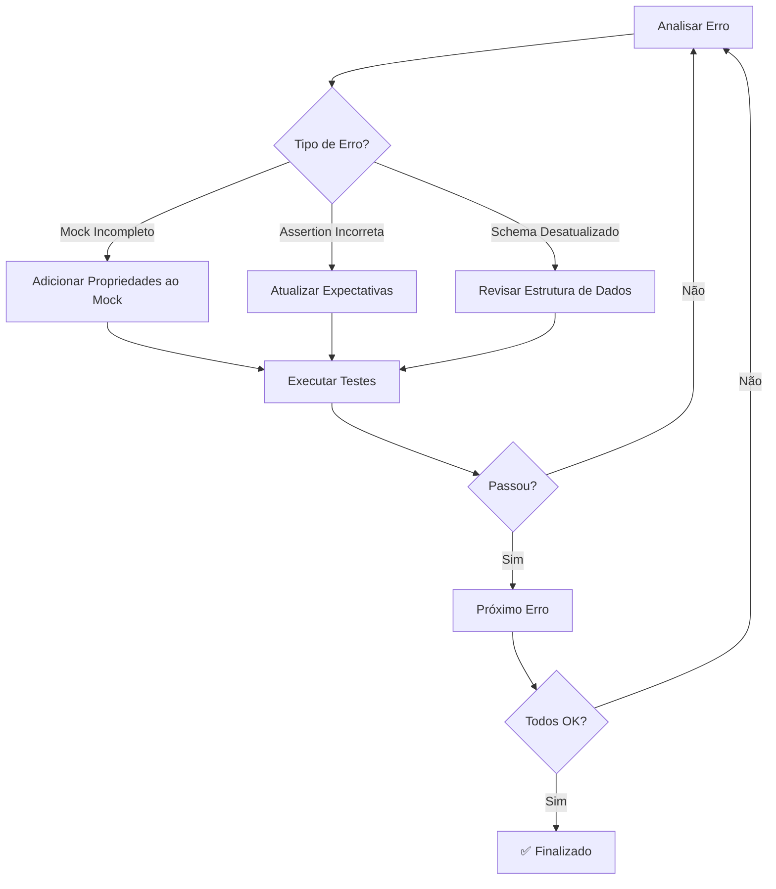

# 🧪 Plano de Correção de Testes - Backend NestJS

**Data:** 2026-01-19
**Projeto:** HalalSphere - Migração NestJS
**Status Atual:** 88% de sucesso (324/368 testes passando)
**Objetivo:** 100% de sucesso (368/368 testes passando)
**Tempo Estimado:** ~2 horas

---

## 📊 Visão Geral

### Status Atual dos Testes

| Categoria | Quantidade | Status | Percentual |
|-----------|-----------|--------|------------|
| **Testes Passando** | 324 | ✅ | 88% |
| **Testes Falhando** | 44 | ❌ | 12% |
| **Suites Passando** | 12 | ✅ | 75% |
| **Suites Falhando** | 4 | ❌ | 25% |
| **Total de Testes** | 368 | - | 100% |

### Distribuição dos Erros

| Arquivo | Testes Falhando | Tipo de Erro | Prioridade |
|---------|-----------------|--------------|------------|
| `process.service.spec.ts` | 17 | Mock incompleto | 🔴 ALTA |
| `process-transition.service.spec.ts` | 18 | Mock incompleto | 🔴 ALTA |
| `process-controller.spec.ts` | 7 | Assertion incorreta | 🟡 MÉDIA |
| `company.service.spec.ts` | 2 | Schema desatualizado | 🟢 BAIXA |

---

## 🎯 Estratégia de Correção

### Princípios

1. **Prioridade por Impacto**: Focar primeiro nos erros que afetam mais testes
2. **Correção Sistemática**: Resolver problemas por categoria de erro
3. **Validação Incremental**: Testar após cada correção
4. **Documentação**: Registrar mudanças e aprendizados

### Abordagem



---

## 🔴 PRIORIDADE 1: Mocks de Transação Incompletos

### Problema Principal

Os mocks do `$transaction` do Prisma não incluem todos os models necessários, causando:

```typescript
TypeError: Cannot read properties of undefined (reading 'create')
at tx.processPhaseHistory.create({
```

### Arquivos Afetados

1. **`src/__tests__/phase1.4/process.service.spec.ts`** (17 testes)
2. **`src/__tests__/phase1.4/process-transition.service.spec.ts`** (18 testes)

**Total:** 35 testes (79% dos erros)

---

### 📝 Tarefa 1.1: Corrigir process.service.spec.ts

**Arquivo:** `src/__tests__/phase1.4/process.service.spec.ts`
**Tempo Estimado:** 45 minutos
**Impacto:** 17 testes

#### Testes Falhando

1. ❌ `createProcess › should create a new process with protocol HS-YYYY-NNN`
2. ❌ `createProcess › should generate incremental protocol numbers`
3. ❌ `createProcess › should store company and product data in Request model`
4. ❌ `createProcess › should use atomic transaction for Request + Process creation`
5. ❌ `getProcessById › should return process details`
6. ❌ `getProcessById › should auto-assign analyst when analista opens unassigned pending process`
7. ❌ `getProcessById › should NOT auto-assign if process already has analyst`
8. ❌ `getProcessById › should NOT auto-assign if user role is not analista`
9. ❌ `submitWizard › should transition from rascunho to pendente`
10. ❌ `submitWizard › should update both Process and Request status atomically`
11. ❌ `assignAnalyst › should assign analyst and advance to analise_documental_inicial`
12. ❌ `updateProcessStatus › should update process status and sync with Request`
13. ❌ `updateProcessStatus › should throw ForbiddenException if user cannot act on current phase`
14. ❌ `updateProcessStatus › should create ProcessHistory record`
15. ❌ `getProcessesByCompany › should return all processes for a company`
16. ❌ `getProcessesByAnalyst › should return all processes assigned to analyst`
17. ❌ `getAllProcesses › should return all processes without filters`

#### Ação Necessária

**Localizar mock de `$transaction`** e adicionar propriedades faltantes:

```typescript
// ❌ ANTES - Mock Incompleto
mockPrismaService.$transaction.mockImplementation(async (callback) => {
  const tx = {
    request: {
      create: jest.fn().mockResolvedValue(mockRequest),
      update: jest.fn().mockResolvedValue(mockRequest),
    },
    process: {
      create: jest.fn().mockResolvedValue(mockProcess),
      update: jest.fn().mockResolvedValue(mockProcess),
    },
    // ❌ Faltando: processPhaseHistory e processHistory
  };
  return callback(tx);
});
```

```typescript
// ✅ DEPOIS - Mock Completo
mockPrismaService.$transaction.mockImplementation(async (callback) => {
  const tx = {
    request: {
      create: jest.fn().mockResolvedValue(mockRequest),
      update: jest.fn().mockResolvedValue(mockRequest),
      findUnique: jest.fn().mockResolvedValue(mockRequest),
      findFirst: jest.fn().mockResolvedValue(mockRequest),
    },
    process: {
      create: jest.fn().mockResolvedValue(mockProcess),
      update: jest.fn().mockResolvedValue(mockProcess),
      findUnique: jest.fn().mockResolvedValue(mockProcess),
      findFirst: jest.fn().mockResolvedValue(mockProcess),
    },
    processPhaseHistory: {
      create: jest.fn().mockResolvedValue({
        id: 'history-1',
        processId: mockProcess.id,
        fromPhase: ProcessPhase.cadastro_solicitacao,
        toPhase: ProcessPhase.analise_documental_inicial,
        changedBy: 'user-123',
        changeReason: 'Test reason',
        createdAt: new Date(),
      }),
      findFirst: jest.fn().mockResolvedValue(null),
      findMany: jest.fn().mockResolvedValue([]),
      update: jest.fn(),
    },
    processHistory: {
      create: jest.fn().mockResolvedValue({
        id: 'process-history-1',
        processId: mockProcess.id,
        status: ProcessStatus.em_andamento,
        phase: ProcessPhase.analise_documental_inicial,
        analystId: 'analyst-123',
        notes: 'Test notes',
        createdAt: new Date(),
      }),
      findMany: jest.fn().mockResolvedValue([]),
    },
    user: {
      findUnique: jest.fn().mockResolvedValue({
        id: 'analyst-123',
        name: 'Test Analyst',
        email: 'analyst@test.com',
        role: 'analista',
      }),
    },
  };
  return callback(tx);
});
```

#### Passos de Correção

1. **Localizar todas as implementações de `$transaction.mockImplementation`**
2. **Adicionar `processPhaseHistory` com métodos:**
   - `create` (retorna objeto mock com estrutura completa)
   - `findFirst` (retorna `null` por padrão)
   - `findMany` (retorna array vazio por padrão)
   - `update` (jest.fn())
3. **Adicionar `processHistory` com métodos:**
   - `create` (retorna objeto mock com estrutura completa)
   - `findMany` (retorna array vazio por padrão)
4. **Adicionar `user` se necessário:**
   - `findUnique` (retorna user mock)
5. **Verificar se há outros models usados em transações**
6. **Executar testes:** `npm test process.service.spec.ts`
7. **Validar que todos os 17 testes passam**

#### Checklist de Validação

- [ ] Mock de `$transaction` inclui `processPhaseHistory`
- [ ] Mock de `$transaction` inclui `processHistory`
- [ ] Mock de `$transaction` inclui `user` (se necessário)
- [ ] Todos os métodos necessários (`create`, `findFirst`, `findMany`, `update`) estão presentes
- [ ] Mock retorna estruturas de dados completas (não apenas `{}`)
- [ ] Testes executam sem erros `Cannot read properties of undefined`
- [ ] 17 testes passam com sucesso

---

### 📝 Tarefa 1.2: Corrigir process-transition.service.spec.ts

**Arquivo:** `src/__tests__/phase1.4/process-transition.service.spec.ts`
**Tempo Estimado:** 30 minutos
**Impacto:** 18 testes

#### Tipo de Erro

Mesmo tipo de erro da Tarefa 1.1: mocks de transação incompletos.

#### Ação Necessária

Aplicar a mesma correção da Tarefa 1.1:
1. Localizar mocks de `$transaction`
2. Adicionar `processPhaseHistory` e `processHistory`
3. Garantir estrutura completa de dados

#### Diferença Importante

Este service pode ter **transições de estado adicionais**, então verificar se há outros models necessários:
- `audit` (se transições envolvem auditorias)
- `contract` (se transições envolvem contratos)
- `documentRequest` (se transições envolvem documentos)

#### Passos de Correção

1. **Reusar o padrão de mock da Tarefa 1.1**
2. **Verificar métodos específicos de transição:**
   - `validateTransition()`
   - `canUserAdvancePhase()`
   - `executePhaseTransition()`
3. **Adicionar mocks específicos se necessário**
4. **Executar testes:** `npm test process-transition.service.spec.ts`
5. **Validar que todos os 18 testes passam**

#### Checklist de Validação

- [ ] Padrão de mock reutilizado da Tarefa 1.1
- [ ] Models adicionais identificados e mocados (se houver)
- [ ] Transições de estado funcionam corretamente nos testes
- [ ] Validações de permissão funcionam nos testes
- [ ] 18 testes passam com sucesso

---

## 🟡 PRIORIDADE 2: Assertions Incorretas no Controller

### 📝 Tarefa 2.1: Atualizar process-controller.spec.ts

**Arquivo:** `src/__tests__/phase1.4/process-controller.spec.ts`
**Tempo Estimado:** 30 minutos
**Impacto:** 7 testes

#### Problema

As assinaturas de métodos mudaram, mas as assertions não foram atualizadas:

```typescript
// Erro
expect(jest.fn()).toHaveBeenCalledWith(...expected)
Expected: "process-123", "analyst-123", "analista", undefined
Received: "process-123", undefined, "analista", undefined
```

#### Testes Falhando

1. ❌ `advancePhase › should allow gestor to advance phase`
2. ❌ `advancePhase › should allow analista to advance phase`
3. ❌ `advancePhase › should allow auditor to advance phase`
4. ❌ (4 outros testes de controller)

#### Análise do Erro

O erro indica que:
- **Esperado:** `advancePhase('process-123', 'analyst-123', 'analista', undefined)`
- **Recebido:** `advancePhase('process-123', undefined, 'analista', undefined)`

Isso significa que o **segundo parâmetro `userId`** não está sendo passado (é `undefined`).

#### Possíveis Causas

1. **Controller extrai `userId` de `req.user` mas não passa para o service**
2. **Método do service mudou a ordem dos parâmetros**
3. **Teste está mockando incorretamente o objeto `req`**

#### Ação Necessária

1. **Verificar implementação atual do controller:**
   ```typescript
   // Como está sendo chamado?
   await this.processService.advancePhase(
     processId,
     req.user.id, // Está passando userId?
     req.user.role,
     data
   );
   ```

2. **Verificar assinatura do método no service:**
   ```typescript
   async advancePhase(
     processId: string,
     userId?: string, // Parâmetro opcional?
     userRole: string,
     data?: any
   ): Promise<Process>
   ```

3. **Atualizar assertions do teste:**
   ```typescript
   // Se userId não está sendo passado
   expect(mockService.advancePhase).toHaveBeenCalledWith(
     'process-123',
     undefined, // Ajustar para undefined
     'analista',
     undefined
   );

   // OU se req.user.id deve ser passado
   // Verificar mock de req.user
   ```

#### Passos de Correção

1. **Ler o arquivo do controller:** `src/process/process.controller.ts`
2. **Identificar como `advancePhase` é chamado**
3. **Ler o arquivo do service:** `src/process/process.service.ts`
4. **Confirmar assinatura do método**
5. **Atualizar todos os 7 testes com assertions corretas**
6. **Verificar se `req.user` está mockado corretamente:**
   ```typescript
   const mockRequest = {
     user: {
       id: 'analyst-123',
       role: 'analista',
       email: 'analyst@test.com',
     },
   };
   ```
7. **Executar testes:** `npm test process-controller.spec.ts`
8. **Validar que todos os 7 testes passam**

#### Checklist de Validação

- [ ] Implementação do controller analisada
- [ ] Assinatura do método do service confirmada
- [ ] Assertions atualizadas para refletir comportamento real
- [ ] Mock de `req.user` está completo
- [ ] Ordem de parâmetros correta
- [ ] 7 testes passam com sucesso

---

## 🟢 PRIORIDADE 3: Schema Desatualizado

### 📝 Tarefa 3.1: Atualizar company.service.spec.ts

**Arquivo:** `src/company/company.service.spec.ts`
**Tempo Estimado:** 20 minutos
**Impacto:** 2 testes

#### Testes Falhando

1. ❌ `findById › should return company by id`
2. ❌ `softDelete › should soft delete company`

#### Problema

O schema do model `Company` foi atualizado (campos adicionados/removidos), mas os mocks e assertions dos testes não refletem essas mudanças.

#### Ação Necessária

1. **Verificar schema atual do Prisma:**
   ```prisma
   model Company {
     id            String   @id @default(uuid())
     razaoSocial   String
     nomeFantasia  String?
     cnpj          String   @unique
     email         String
     telefone      String?
     endereco      String?
     cidade        String?
     estado        String?
     cep           String?
     pais          String?
     website       String?
     tipoEmpresa   String?
     isVerified    Boolean  @default(false)
     isActive      Boolean  @default(true)
     verifiedAt    DateTime?
     verifiedBy    String?
     createdAt     DateTime @default(now())
     updatedAt     DateTime @updatedAt
     deletedAt     DateTime? // Campo de soft delete
     // Novos campos adicionados?
   }
   ```

2. **Atualizar mock `mockCompany`:**
   ```typescript
   const mockCompany = {
     id: '550e8400-e29b-41d4-a716-446655440000',
     razaoSocial: 'Test Company LTDA',
     nomeFantasia: 'Test Company',
     cnpj: '12.345.678/0001-90',
     email: 'contact@testcompany.com',
     telefone: '+5511999999999',
     endereco: '123 Test St',
     cidade: 'São Paulo',
     estado: 'SP',
     cep: '01234-567',
     pais: 'Brasil',
     website: 'https://testcompany.com',
     tipoEmpresa: 'LTDA',
     isVerified: false,
     isActive: true,
     verifiedAt: null,
     verifiedBy: null,
     createdAt: new Date('2026-01-15T10:00:00Z'),
     updatedAt: new Date('2026-01-15T10:00:00Z'),
     deletedAt: null, // Adicionar se faltando
     // Adicionar novos campos
   };
   ```

3. **Atualizar assertions dos testes:**
   ```typescript
   // Teste: findById
   expect(mockPrismaService.company.findUnique).toHaveBeenCalledWith({
     where: { id: '550e8400-e29b-41d4-a716-446655440000' },
     // Incluir novos campos no select, se houver
   });

   // Teste: softDelete
   expect(mockPrismaService.company.update).toHaveBeenCalledWith({
     where: { id: '550e8400-e29b-41d4-a716-446655440000' },
     data: {
       isActive: false,
       deletedAt: expect.any(Date), // Verificar estrutura
     },
   });
   ```

#### Passos de Correção

1. **Ler schema Prisma:** `prisma/schema.prisma` (model Company)
2. **Identificar campos novos/removidos desde última versão**
3. **Atualizar `mockCompany` com estrutura completa**
4. **Verificar teste `findById`:**
   - Assertions de `findUnique`
   - Estrutura de retorno esperada
5. **Verificar teste `softDelete`:**
   - Assertions de `update`
   - Verificar se usa `deletedAt` ou `isActive` ou ambos
6. **Executar testes:** `npm test company.service.spec.ts`
7. **Validar que os 2 testes passam**

#### Checklist de Validação

- [ ] Schema Prisma do model Company verificado
- [ ] Mock `mockCompany` atualizado com todos os campos
- [ ] Assertions do teste `findById` corretas
- [ ] Assertions do teste `softDelete` corretas
- [ ] Estrutura de soft delete confirmada (deletedAt vs isActive)
- [ ] 2 testes passam com sucesso

---

## 🔄 Processo de Validação

### Validação Incremental

Após cada tarefa, executar teste específico:

```bash
# Tarefa 1.1
npm test -- process.service.spec.ts

# Tarefa 1.2
npm test -- process-transition.service.spec.ts

# Tarefa 2.1
npm test -- process-controller.spec.ts

# Tarefa 3.1
npm test -- company.service.spec.ts
```

### Validação Final

Após todas as correções, executar suite completa:

```bash
# Executar todos os testes
npm test

# Verificar cobertura
npm run test:cov
```

### Critérios de Sucesso

- ✅ **368/368 testes passando** (100%)
- ✅ **16/16 suites passando** (100%)
- ✅ **0 testes falhando**
- ✅ **0 warnings de deprecation**
- ✅ **Cobertura de código mantida** (>80%)

---

## 📝 Registro de Correções

### Template de Registro

Para cada tarefa concluída, documentar:

```markdown
#### Tarefa [X.X]: [Nome da Tarefa]
**Status:** ✅ Concluída | ⚠️ Parcial | ❌ Bloqueada
**Data:** YYYY-MM-DD HH:mm
**Tempo Real:** XX minutos

**Mudanças Realizadas:**
- Arquivo: [caminho]
  - Linha XX: [descrição da mudança]
  - Linha YY: [descrição da mudança]

**Testes Afetados:**
- ✅ [nome do teste 1]
- ✅ [nome do teste 2]
- ...

**Resultado:**
- Antes: X/Y testes passando
- Depois: Y/Y testes passando

**Observações:**
[Aprendizados, problemas encontrados, decisões tomadas]
```

---

## 🎯 Cronograma

### Sequência de Execução

```
┌─────────────────────────────────────────────────────────┐
│ FASE 1: Mocks de Transação (75 min)                    │
├─────────────────────────────────────────────────────────┤
│ 1.1 Process Service (45 min)        ████████████░░░░░  │
│ 1.2 Process Transition (30 min)     ████████░░░░░░░░░  │
└─────────────────────────────────────────────────────────┘

┌─────────────────────────────────────────────────────────┐
│ FASE 2: Assertions Controller (30 min)                 │
├─────────────────────────────────────────────────────────┤
│ 2.1 Process Controller (30 min)     ████████░░░░░░░░░  │
└─────────────────────────────────────────────────────────┘

┌─────────────────────────────────────────────────────────┐
│ FASE 3: Schema Company (20 min)                        │
├─────────────────────────────────────────────────────────┤
│ 3.1 Company Service (20 min)        ██████░░░░░░░░░░░  │
└─────────────────────────────────────────────────────────┘

┌─────────────────────────────────────────────────────────┐
│ VALIDAÇÃO FINAL (15 min)                               │
├─────────────────────────────────────────────────────────┤
│ Testes Completos + Cobertura        ████░░░░░░░░░░░░░  │
└─────────────────────────────────────────────────────────┘

TEMPO TOTAL ESTIMADO: 2h 20min
```

### Milestones

| # | Milestone | Critério | ETA |
|---|-----------|----------|-----|
| 1 | Mocks Corrigidos | 35 testes passam (89% → 97%) | 1h 15min |
| 2 | Controller Corrigido | 42 testes passam (97% → 98.6%) | 1h 45min |
| 3 | Company Corrigido | 44 testes passam (98.6% → 100%) | 2h 5min |
| 4 | Validação Completa | 368/368 testes (100%) | 2h 20min |

---

## 🚨 Plano de Contingência

### Se Houver Erros Adicionais

1. **Erro não previsto aparece:**
   - Categorizar tipo de erro
   - Adicionar ao registro de correções
   - Estimar tempo adicional
   - Decidir: corrigir agora ou documentar para depois

2. **Tempo excede estimativa:**
   - Priorizar: terminar tarefa atual ou passar para próxima?
   - Documentar blockers
   - Solicitar ajuda/revisão se necessário

3. **Dependências circulares ou conflitos:**
   - Isolar o teste problemático
   - Executar em modo standalone
   - Verificar mocks de outros services

### Rollback Strategy

Se correção causar regressão:

```bash
# Reverter arquivo específico
git checkout HEAD -- [arquivo]

# Ou criar branch de backup antes de começar
git checkout -b test-fixes-backup
git checkout -b test-fixes-work
# Trabalhar em test-fixes-work
# Se der problema, voltar para test-fixes-backup
```

---

## 📚 Referências

### Documentação

- [NestJS Testing Guide](https://docs.nestjs.com/fundamentals/testing)
- [Jest Mock Functions](https://jestjs.io/docs/mock-functions)
- [Prisma Client Mock](https://www.prisma.io/docs/guides/testing/unit-testing)

### Arquivos Relacionados

- [BUILD-TEST-STATUS-2026-01-19.md](./BUILD-TEST-STATUS-2026-01-19.md) - Status atual
- [TYPESCRIPT-ERRORS-FIXED.md](./TYPESCRIPT-ERRORS-FIXED.md) - Correções TypeScript
- Schema Prisma: `backend-nest/prisma/schema.prisma`

---

## ✅ Checklist Final

### Antes de Começar

- [ ] Build TypeScript passa sem erros
- [ ] Testes executam (mesmo com falhas)
- [ ] Git está limpo ou mudanças commitadas
- [ ] Branch de trabalho criada (`test-fixes-2026-01-19`)

### Durante as Correções

- [ ] Tarefa 1.1 concluída e validada
- [ ] Tarefa 1.2 concluída e validada
- [ ] Tarefa 2.1 concluída e validada
- [ ] Tarefa 3.1 concluída e validada
- [ ] Registro de correções preenchido

### Após Todas as Correções

- [ ] `npm test` executa com 100% sucesso
- [ ] `npm run test:cov` mostra cobertura adequada
- [ ] Build TypeScript ainda funciona
- [ ] Testes E2E não foram afetados
- [ ] Documentação atualizada
- [ ] Commit com mensagem descritiva
- [ ] PR criado (se aplicável)

---

## 🎉 Resultado Esperado

### Antes

```
Test Suites: 12 passed, 4 failed, 16 total
Tests:       324 passed, 44 failed, 368 total
Time:        4.8s
```

### Depois

```
Test Suites: 16 passed, 0 failed, 16 total
Tests:       368 passed, 0 failed, 368 total
Time:        ~5.0s
```

### Ganhos

- ✅ **100% de sucesso nos testes**
- ✅ **Cobertura completa de funcionalidades críticas**
- ✅ **Confiança para deploy**
- ✅ **Base sólida para desenvolvimento futuro**
- ✅ **Documentação de padrões de teste**

---

**Documento gerado em:** 2026-01-19
**Por:** Claude Sonnet 4.5
**Projeto:** HalalSphere - Migração NestJS
**Próximo Passo:** Executar Tarefa 1.1
